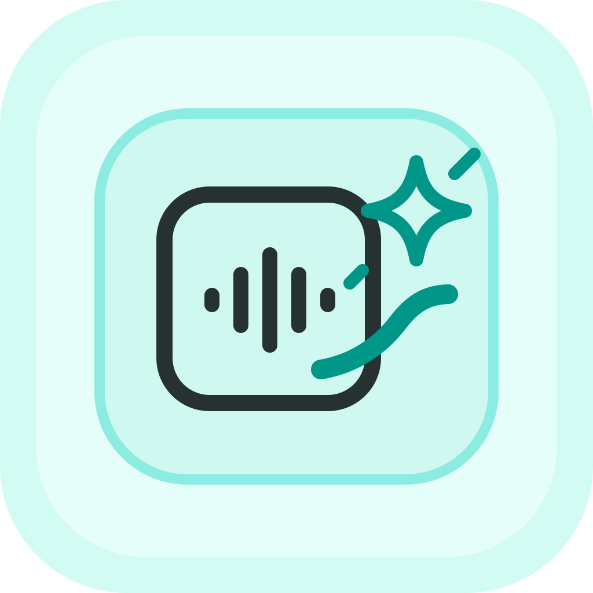
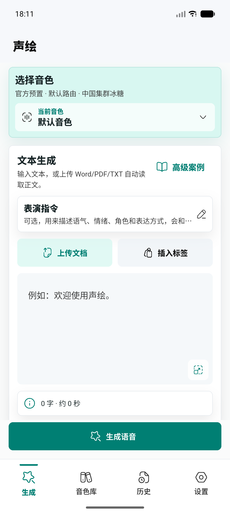
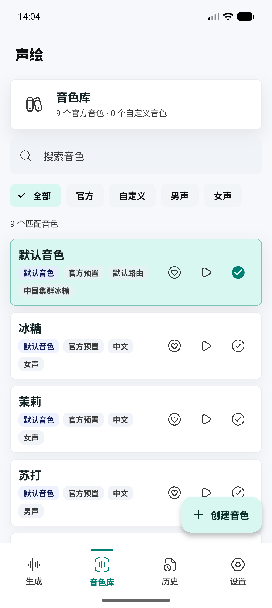
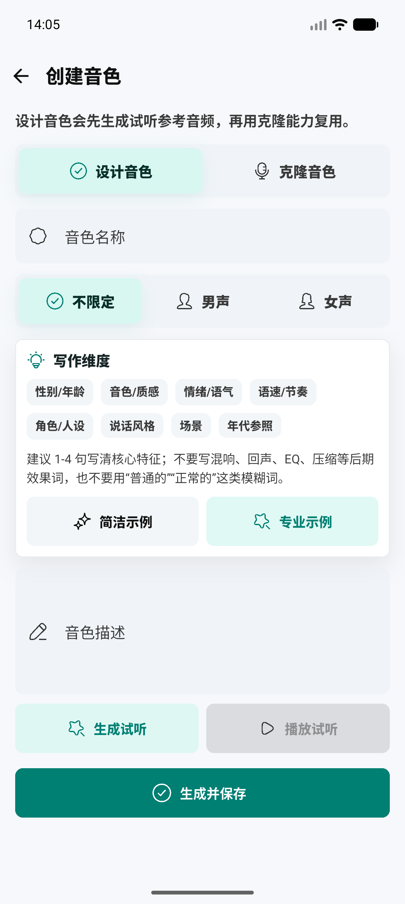
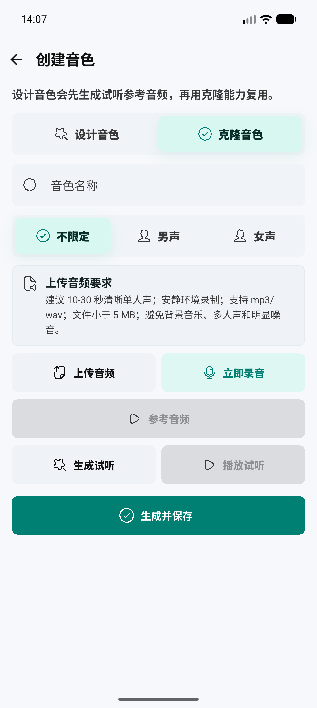
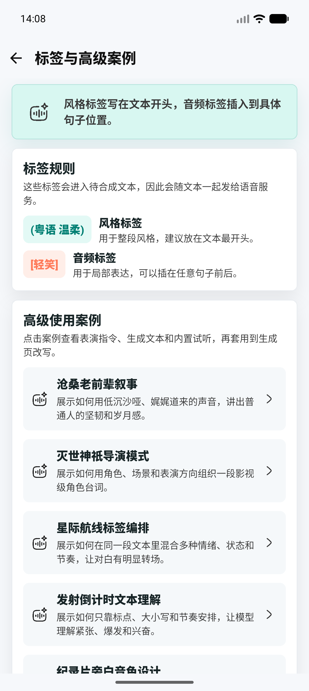
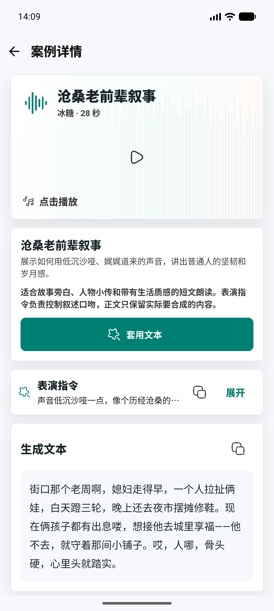

# 声绘 AI Voice Studio

<p align="center">
  
</p>

<p align="center">
  <strong>一款基于 Flutter 的 AI 语音生成、音色设计与声音克隆应用。</strong>
</p>

<p align="center">
  <a href="https://shenghui.cloudlark.net/">官网</a>
  ·
  <a href="https://shenghui.cloudlark.net/#download">下载</a>
  ·
  <a href="https://github.com/FuKun0113/shenghui-ai-voice-studio/releases">Releases</a>
  ·
  <a href="https://github.com/FuKun0113/shenghui-ai-voice-studio/issues">Issues</a>
</p>

<p align="center">
  <a href="LICENSE"></a>
  
  
</p>

声绘是一款 Android 优先的 AI 语音工作室，面向文本转语音、音色管理、音色设计、声音克隆和语音内容创作场景。项目使用 Flutter 开发，同时保留 iOS、macOS、Windows、Web 等多端扩展空间。

English keywords: Flutter AI voice studio, TTS, voice cloning, speech synthesis, voice design, OpenAI-compatible API, MiMo-compatible API, Android app.

## 界面预览

<table>
  <tr>
    <td align="center"><br>生成语音</td>
    <td align="center"><br>音色库</td>
    <td align="center"><br>音色设计</td>
  </tr>
  <tr>
    <td align="center"><br>声音克隆</td>
    <td align="center"><br>高级案例</td>
    <td align="center"><br>案例详情</td>
  </tr>
</table>

## 核心能力

- AI 语音生成：输入文本后生成语音，支持即时播放、历史记录、重生成、下载、分享和删除。
- 音色库：管理官方音色、自定义音色、收藏音色和最近使用音色，支持分类筛选。
- 音色设计：通过专业化音色描述生成试听，保存后作为可复用音色。
- 声音克隆：支持即时录音或上传参考音频，用于创建自定义声音。
- 表演指令：在生成前描述语气、节奏、角色状态和表达方式，让语音更有表现力。
- 高级标签：支持风格标签、音频标签、方言标签，并在输入框、历史详情和案例详情中高亮显示。
- 文档导入：支持 TXT、Word、PDF 文档文本提取，用于较长内容的分段生成。
- 文本优化：支持 OpenAI 兼容接口，用于生成表演指令、优化文本、插入语音标签。
- 本地优先：API URL、API Key、音色和历史数据保存在用户设备本地。

## 语音示例

仓库中内置了部分高级案例音频，方便了解标签、音色设计和叙事类语音的效果：

- [风格与音频标签示例](assets/audio/examples/mimo-doc-audio-tags.wav)
- [冰糖葫芦故事示例](assets/audio/examples/mimo-doc-case1-bingtang.wav)
- [倒计时音频标签示例](assets/audio/examples/mimo-doc-countdown.wav)
- [旁白音色设计示例](assets/audio/examples/mimo-doc-voice-design-narrator.wav)

## 服务配置

声绘不会在源码中内置任何私有 API Key。用户需要在 App 的设置页中填写自己的服务地址和密钥。

语音服务需要提供项目当前调用方式所需的能力：

- 文本转语音模型
- 音色设计模型
- 声音克隆模型

文本优化服务使用 OpenAI 兼容接口，主要用于辅助完成：

- 根据正文生成表演指令
- 改写或扩写语音文案
- 为文本插入风格标签、音频标签和方言标签

## 技术栈

- Flutter / Dart
- Material 3 风格组件
- Android 原生构建链路
- OpenAI-compatible HTTP API
- MiMo-compatible speech synthesis API
- 本地存储、音频播放、录音、文件导入、分享与下载

## 快速开始

请先安装 Flutter，并确保 Android 开发环境可用。

```bash
flutter pub get
flutter run
```

运行测试：

```bash
flutter test
```

构建 Android APK：

```bash
flutter build apk --release
```

构建 Android App Bundle：

```bash
flutter build appbundle --release
```

## 项目结构

```text
assets/                 App 图标、内置试听音频和高级案例音频
docs/images/screenshots README 使用的界面截图
lib/src/domain          领域模型
lib/src/services        API、存储、音频、配置等服务
lib/src/state           App 状态管理
lib/src/ui              页面、组件和交互
test/                   单元测试和 Widget 测试
```

## 合规提醒

声音克隆和语音合成属于敏感能力。请仅在拥有合法授权的前提下使用录音、上传音频、音色设计和声音克隆功能。

禁止使用本项目克隆、合成或传播未授权个人的声音，尤其是公众人物、未成年人或其他受保护主体的声音。使用者需要自行承担由内容生成、传播、授权和商业使用产生的法律责任。

## 隐私说明

- 用户填写的 API URL 和 API Key 保存在本地设备中。
- 项目源码不包含私有语音服务密钥。
- 上传音频、录音和生成文本会发送到用户自行配置的服务端，具体数据处理规则以对应服务商为准。
- 生成历史、音色信息和本地缓存由 App 在设备侧管理。

## 路线图

- 完善桌面端适配与窗口布局。
- 增强长文本分段生成和批量任务体验。
- 增加更多内置高级案例和语音创作模板。
- 优化音频波形、播放器和历史详情体验。
- 补充更多自动化测试和发布前检查。

## Star History

<a href="https://www.star-history.com/#FuKun0113/shenghui-ai-voice-studio&Date">
  
</a>

## 支持项目

如果声绘对你有帮助，欢迎通过打赏支持项目的持续开发和维护。打赏完全自愿，感谢每一份支持。

<table>
  <tr>
    <td align="center"><br>支付宝</td>
    <td align="center"><br>微信支付</td>
  </tr>
</table>

## 参与贡献

欢迎提交 Issue 和 Pull Request。你可以帮助完善：

- Bug 修复和兼容性问题
- UI/UX 细节
- 文档、截图和使用示例
- 多端适配
- 测试覆盖

## 开源协议

本项目使用 Apache License 2.0。详见 [LICENSE](LICENSE)。

## Topics

`flutter` `dart` `tts` `voice-cloning` `ai-voice` `speech-synthesis` `android` `mimo` `openai-compatible`
